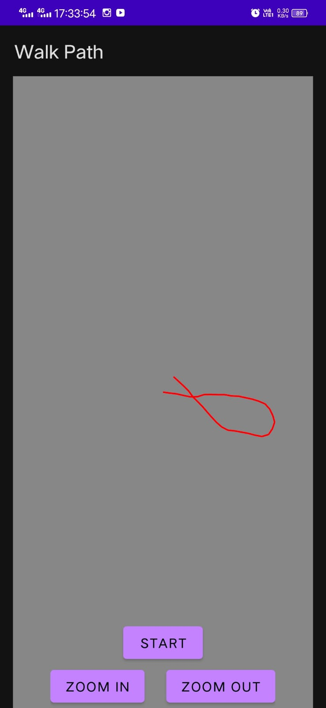

# Walk-Path

> Submission for Appstrix, Innovacion

## Installation
- Find the APK file in this repo at: `./app-release.apk`
- Install it your device
- If received warning from Play Protect, continue by tapping on "Install Anyway"

## Usage
- Manually set permissions for the App through your Device's settings
- Open up the App
- Tap on START button
- Move around with the device in your hand and keep swiping the START Button
    - Do no Tap on the START button on a walking session as it it'll reset the session
    - Keep swiping the START button to record coordinates, if not swiping the button, then the coordinates wont be captured
- When the walking session is over, press on the START button again to stop
- On closing the App, data is stored in the CSV file
  - The CSV file might be hidden in the Device's file explorer
  - The CSV file is located at: `/storage/emulated/0/Android/data/com.sparidtech.walkpath/files/walk-path/Path.csv`

## Screenshot

## Team
- Aayush Chowdhury
- Huzefa Chaiwala
- Kinjal Raykarmakar